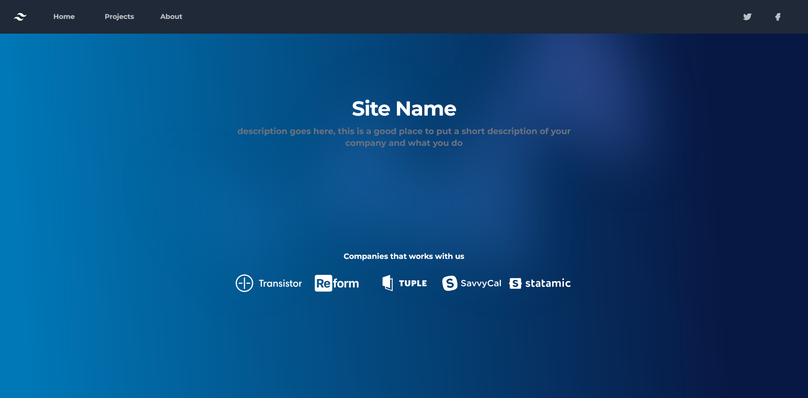
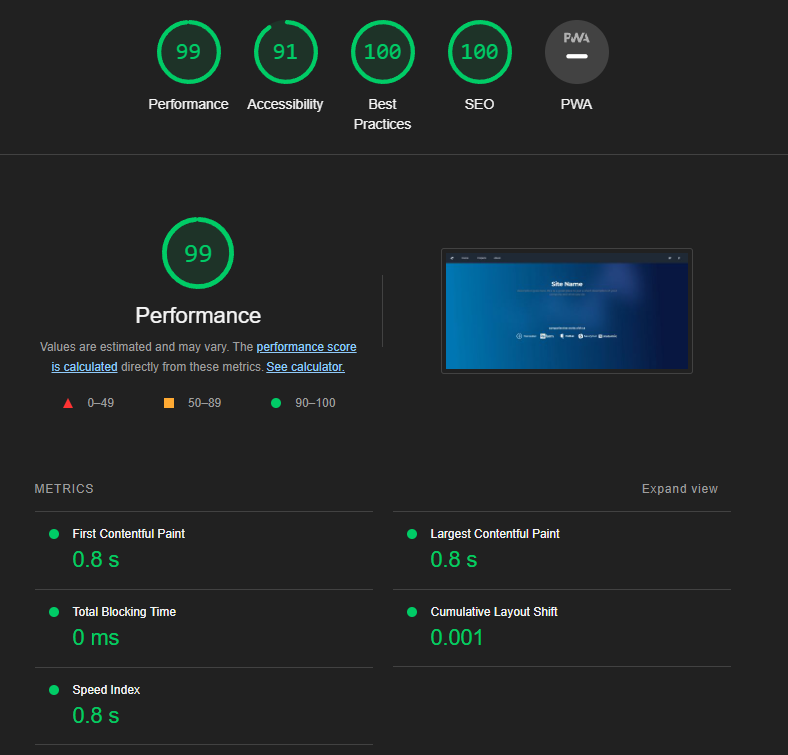

# Static Website Template

This is a static website template built using [Astro](https://astro.build/), [Tailwind CSS](https://tailwindcss.com/), and a bit of JavaScript to handle mobile device dropdowns. It is designed to be a starting point for static websites that are fast, accessible, and SEO friendly. It is also designed to be easily customizable to fit your project's needs.

## Features

- **High Performance:** Achieves a Lighthouse score of 99 in performance.
- **Accessibility:** Built with accessibility in mind, scoring 91 in Lighthouse.
- **Best Practices:** Follows best practices according to Lighthouse with a score of 100.
- **SEO Friendly:** Optimized for search engines with a perfect Lighthouse SEO score.
- **Mobile-Friendly:** Includes responsive design and mobile device dropdown functionality.
- **Customizable:** Easily customize the template to your project's needs.
- **Tailwind CSS:** Uses the popular Tailwind CSS framework for easy styling.

## License

This project is open source and is released under the [GNU General Public License (GPL)](LICENSE). You are free to use, modify, and distribute this project in accordance with the terms of the GPL. Please see the [LICENSE](LICENSE) file for more details.
